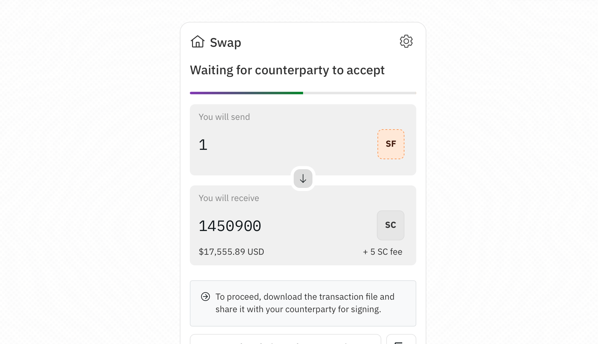

---

Embarcadero is a tool for conducting escrowless SF<->SC swaps.

Executing a swap is a three-part process. Here, we assume that the swappers,
Alice and Bob, have established a communication channel and have negotiated the
terms of the swap (in this case, 7SF for 10MS).

1. Alice begins by creating a transaction with two outputs: one worth 7SF, and
   one worth 10MS. She adds inputs from her wallet worth 7SF, but does _not_
   sign anything yet. She sends this partially-completed transaction to Bob.
2. Bob reviews the transaction and confirms that its outputs are correct. He
   then adds inputs from his wallet worth 10MS, signs the transaction, and
   returns it to Alice.
3. Alice reviews the transaction (in case Bob did something malicious). Assuming
   all is well, she adds her signatures. The transaction is now complete, so
   Alice broadcasts it to the Sia network for inclusion in the next block.

To launch the swap creation interface, just run `embc` from your terminal. If you prefer to use a CLI, that's supported as well:

- `embc create` creates the initial transaction with Alice's inputs
- `embc accept` adds Bob's inputs and signatures
- `embc finish` adds Alice's signatures and broadcasts the transaction

As long as Alice and Bob dutifully review the transaction details (displayed in the UI or when running `accept` or `finish`), their funds are never at risk. In
particular, even though Bob adds his signatures before Alice does, those
signatures are _only_ valid for that specific swap transaction. That is, Alice
can't change the terms of the swap without also invalidating Bob's signatures.
